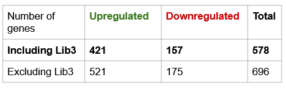

---
output:
  html_document: default
  pdf_document: default
---
# NGS Practicals

This is the description of the workflow and code used in my NGS practicals in November 2020. These practicals aimed at studying the interferon response in the bat species Myotis velifer.

## Introduction

Bats have been observed to be frequently infected by various viruses, but seem to be asymptotic in most cases. This raises the question of how bats have adapted to this longterm association with viruses, and a possible hypothesis is that they have evolved a balance between the intensity of the immune response (which has to be strong enough to ensure that the bat's organism is not affected too much by the consequences of a viral infection) and viral tolerance (to avoid living in a state of permanent inflammatory response).

One important aspect of the immune response upon infection by a virus is the interferon response: when viral particles are detected by immune cells, they produce particles called interferons, which in turn activate specific genes called Interferon Stimulated Genes (ISGs) that target various stages of the viral replication cycle. 

This practical aims at studying ISGs in the bat Myotis velifer: to do this, we will analyze RNA-seq data obtained by sequencing the transcriptome of fibroblasts incubated either with (IFN+) or without (IFN-) interferons, to try and determine what genes are upregulated or downregulated in the IFN+ condition. We will then compare the regulated genes to known ISGs of other mammal species.

The following image displays an overview of the workflow:


## 1 - Data download (download_data.sh)

To download the data used in these practicals, we use a command that specifies the address of the directory containing what we want, as well as the user name and password we need to get there.

The files are under the fastq.gz format, that is a compressed fastq format. fastq files contain read sequences as well as information on the quality of those reads.

After downloading it, I moved the data to a new directory: it is now in a specific directory called data_tp_ngs that will contain all the data for these practicals (one directory per type of files).


## 2 - Quality control (quality_control.sh)

### 2.1 - Running fastqc

To start, we run fastqc on our fastq.gz files: this program analyzes the contents of fastq files and returns a report on each file containing graphs summing up things like per base sequence quality, per tile sequence quality, per sequence quality scores, per base sequence content etc. 

#### 2.1.2 - Structure of the script

We build a for loop that goes through each fastq.gz file and runs fastqc on that file. 

#### 2.1.3 - fastqc parameters

The command to call fastqc is fairly simple and goes as follows:
```
fastqc -t 4 sequence_file_name.fastq.gz -o output_directory
```


The -t corresponds to threads, i.e. the number of cores to be dedicated to the task. The -o corresponds to the output directory to store the results in. 

#### 2.1.4 - Results

The output files are stored in a file called fastqc_results. 

For instance, here is the per-base sequence quality plot for the first library: 


And here is an overview of the quality of each library: 


We can see in the outputs that we have per base sequence content anomalies at the beginning of the reads (on approximately 8-9 pairs) and that the quality of the sequencing decreases towards the end of reads (as is expected with an Illumina sequencing). Furthermore, the end of reads often corresponds to the sequencing of Illumina adaptors. Therefore, the data is not clean, and we are going to need to trim it to remove the Illumina adaptator sequences and the regions of poor quality. 

### 2.2 - Running Trimmomatic

To trim the reads, we use Trimmomatic (NB: here we run it separately, but there is also an option in Trinity to run Trimmomatic).

#### 2.2.1 - Structure of the script

Like before, we build a for loop and for each iteration, and we give Trimmomatic two paired files (forward and reverse reads corresponding to a given sample).

#### 2.2.2 - Trimmomatic parameters

- threads: number of cores to use.
- phreds33: one of two options, either phreds33 or phreds64.
- IlluminaClip: clips off sequences corresponding to Illumina adaptators (the reference sequences are given in a file called adapt.fasta).
- Headcrop: crops the beginning of reads by a given number of bases. Here we crop the 9 first bases (since they display per base sequence content anomalies).
- Minlen: discards reads below a given size. Here we discard reads below 100 bases (standard practice).

The command is structured as follows:
```
java -jar /softwares/Trimmomatic-0.39/trimmomatic-0.39.jar PE -threads 8 -phred33 name_of_R1_sequence.fastq.gz name_of_R2.fastq.gz output_forward_paired.fq.gz output_forward_unpaired.fq.gz output_reverse_paired.fq.gz output_reverse_unpaired.fq.gz ILLUMINACLIP:adapt.fasta:2:30:10 MINLEN:100 HEADCROP:9
```
The unpaired outputs correspond to reads for which the corresponding paired reads were discarded in the process. 


### 2.3 - Running fastqc on Trimmomatic results

Now that our reads have been trimmed, we run fastqc on Trimmomatic's output to make sure that everything went as planned and that our new data is cleaner. We repeat the operation described in the fastqc section.

Here is an overview of the data quality after trimming: 


We can see a clear improvement in the quality of reads (the only things flagged by fastqc are the sequence duplication levels, which is normal in the context of RNA-sequencing, and the sequence length distribution, which is also normal since we did not necessarily trim all the reads by the same length).

## 3 - Data assembly (data_assembly.sh)

After running the quality control script, we have clean data files which we can use for data assembly. 

This is done using a program called Trinity.

### 3.1 - Structure of the script

We start by building two strings containing the names of 1) all the forward paired outputs from Trimmomatic, and 2) all the reverse paired outputs from Trimmomatic. 

We then feed these files to Trinity for data assembly. 

NB: this is what I would have done theoretically, but given that Trinity actually takes two days to run on the data used here, the teachers ran it ahead of the practicals and just sent us the results.


### 3.2 - Trinity parameters

- seqType: specifies the sequence format. Here we use fq (fastq) files. 
- left and right (for paired reads): enter reads R1 in left and reads R2 in right.
- SS_lib_type: orientation of the RNA-seq reads. Here it is RF. 
- CPU: number of CPU to use. Here it is 4.
- max_memory: maximum RAM to be dedicated to the process. Usually you should put in your maximum RAM minus 2 (to keep some calculation power in case you need to do something else simultaneously). 
- output: directory in which Trinity should store the outputs.

The command is structured as follows: 
```
Trinity --seqType fq --max_memory 14G --SS_lib_type RF --output $data/trinity_outputs/ --left list_of_paired_forward_files --right list_of_paired_reverse_files --CPU 4
```

### 3.3 - Output files

The output files are stored in a directory called trinity_outputs. We have two files: a .fasta and a .fasta.gene_trans_map. 

In the .fasta file, we have lines (starting with a '>') of the form TRINITY_DNX_cX_gX_iX, with TRINITY_DNX_cX identifying a cluster, TRINITY_DNX_cX_gX identifying a gene in the cluster and TRINITY_DNX_cX_gX_iX identifying an isoform of that gene. These lines are followed by another line with the sequence corresponding to the isoform labeled by the identifier line.  
The identifier lines can be used to count the number of genes, for instance with a line like: 
```
grep ">" Trinity_RF.fasta |cut -f1,2,3,4 -d "_" |sort |uniq |less
```
Basically, we select lines starting with '>' in the Trinity output file, cut them at each "_" symbol and keep the 1st, 2nd, 3rd and 4th parts, which we then sort; finally we only keep one occurrence of a given character string and we show the final result (using less). This operation allows us to keep the TRINITY_DNX_cX_gX part of the identifier lines (corresponding to a gene) and count how many different genes we have. 

The .fasta.gene_trans_map file contains a table with correspondences between genes and isoforms. 


## 4 - Data annotation with Transdecoder and Blast (transdecoder.sh and blastn.sh)

Next, we annotate the data using Transdecoder. Given that we do not have a reference genome, we use the human genome as a reference (because it is annotated in great detail, unlike other organisms that would be closer to the bat).

### 4.1 - Transdecoder (transdecoder.sh)

We look for long ORFs in our reads using Transdecoder.LongOrfs on the Trinity output. We then predict coding regions using Transdecoder.Predict. 

The command lines look like this:

```
TransDecoder.LongOrfs -t $data/trinity_results/Trinity_RF.fasta --gene_trans_map $data/trinity_results/Trinity_RF.fasta.gene_trans_map --output_dir $data/transdecoder_results/ -m 100 -S

TransDecoder.Predict -t $data/trinity_results/Trinity_RF.fasta -O $data/transdecoder_results/ --single_best_only
```

### 4.2 - Blastn (blastn.sh)

#### 4.2.1 - Getting the human reference

We use the wget command, just like we did to download the original data. It looks like this:

```
wget -O $storage_path/Homo_sapiens.GRCh38.cds.fa.gz ftp://ftp.ensembl.org/pub/release-101/fasta/homo_sapiens/cds/Homo_sapiens.GRCh38.cds.all.fa.gz
```

Since the file is compressed, we need to unzip it before using it with: 
```
gunzip file_name
```

#### 4.2.2 - Building the database

We then use this decompressed file to build a reference database with makeblastdb.

makeblastdb arameters:

- dbtype: molecule type of target db, either "nucl" or "prot" (here we use "nucl")
- in: input file name
- input_type: type of data in the input file, either asn1_bin', `asn1_txt', `blastdb', or `fasta'
- out: output name
- parse_seqids: Option to parse seqid for FASTA input if set, for all other input types seqids are parsed automatically

The command looks like this:
```
makeblastdb -dbtype nucl -in Homo_sapiens.GRCh38.cds.fa -input_type fasta -out ouput_file -parse_seqids
```
#### 4.2.3 - Blasting

We then use the database we created to actually do the blast. 

Bastn parameters:

- db: blast database file name
- query: input file name
- evalue: expectation value E (which quantifies the quality of a hit: the smaller, the better) below which we save a hit
- outfmt: alignment view options. Here we use 6: Tabular
- out: output file name
- max_target_seqs: keep only one hit per contig (one annotation per gene)

The command line looks like this:

```
blastn -db makeblastdb_output -query Trinity_RF.fasta.transdecoder.cds -evalue 1e-4 -outfmt 6 -out blast_alignment_output_file -max_target_seqs 1
```

#### 4.2.4 - Output

The blastn output is a table which indicates, for each read, the human gene on which it has been aligned, as well as various elements of information about the hit (length, number of mismatches and gaps, quality of the hit...). 


## 5 - Reads quantification (salmon_alignment.sh)


To annotate and quantify the reads, we use a program called salmon. Salmon is divided in several sub-programs, and we use two of them: salmon index to build an index on which to map the reads, and salmon quant to align and quantify the reads. 

### 5.1 - Salmon index

The command takes the following parameters:

- t: fasta file containing the assembled reads (Trinity output)
- i: directory in which to create the output
- p: number of cores to use in the calculation

The command line looks like this:
```
salmon index -t $data/trinity_results/Trinity_RF.fasta -i $data/salmon_index -p 4
```

The output is stored in a file called salmon_index. 

### 5.2 - Salmon quantification

We then use the index we just created to align our reads (the paired reads corresponding to the outputs of Trimmomatic) with salmon quant. 

#### 5.2.1 - Structure of the script

Just like in previous steps (fastqc or Trimmomatic), we need to process several files one after the other, so we create a for loop going through each pair of files (forward reads and reverse reads) and applying salmon quant to that pair of files.

#### 5.2.2 - salmon quant parameters

The parameters for salmon quant are:

-i: index to use (the salmon index we just built)
- l: library format. We put in A (for Automatic) so that salmon will look at the files we enter and determine it itself. 
- 1: forward reads.
- 2: reverse reads.
- validateMapping: option that is default in the newest versions of salmon, but here we need to indicate it. 
- o: directory in which to put output files.

The command line looks like this: 
```
salmon quant -i $data/salmon_index -l A -1  forward_paired_output.fq.gz -2 reverse_paired_output.fq.gz --validateMappings -o $data/salmon_alignment
```

#### 5.2.3 - salmon quant output

Normally, when aligning reads, a result is considered good when > 80% of reads are aligned. However, here, we only reach around 40% of aligned reads. This is likely due to a problem during sequencing: inserts (RNA fragments) were too small, and therefore the forward and reverse reads overlap. 

#### 5.2.4 - Correcting the salmon quant output

To correct this, we can run salmon quant a second time, but this time we do as if the reads were not paired but single. The parameters are almost all the same except for -1 and -2 which are replaced by -r, and we only give salmon quant one file at a time instead of two. 

The command line looks something like this:
```
salmon quant -i $data/salmon_index -l A -r forward_paired_output.fq.gz --validateMappings -o $data/salmon_alignment_single_end
```

This time, we get around 94% of aligned reads, which is much more satisfying. 


NB: When re-running salmon for technical reasons, I quantified reads in single-end, but the others did it in paired-end, and the results discussed below are based on the paired-end results. 

### 5.3 - Output file

The quantification is done for each isoform separately (and not by gene; more on this in the next section).

- Effective length: the entire transcript length is not necessarily mappable (repeated regions, repetition of one nucleotide...), therefore some parts of it may never be aligned.
- TPM: transcript per million (normalization)
- NumReads: number of reads aligned on the transcript. The value is not necessarily a round number because salmon is a subtle alignment tool and not an exact tool: it can take into account the fact that sometimes, it cannot distinguish between isoforms of paralogs and can attribute an ambiguous read partially to different transcripts. The fraction attributed to one transcript or the other is proportional to the expression of each transcript (an ambiguous read is more likely to correspond to a highly expressed transcript than to a low expressed one).


### 5.4 - Adapting the output to DESeq2

We are going to use the NumReads value, pooled by gene, in DESeq2. To create a table containing that information, we use the tximport library in R with a command structured like this:

```{r}
tximport_file <- tximport(files = file_names, type = "salmon", tx2gene = trinity1)
```

file_names corresponds to the names of the salmon quant outputs.

trinity1 is a table containing the corresponding gene trinity ID (e.g. TRINITY_DN18_c1_g1) for each trinity isoform ID (e.g. TRINITY_DN18_c1_g1_i9). 

## 6 - DESeq2 (DESeq2.rmd)

To determine whether genes are differentially expressed between the two conditions (IFN+ and IFN-), we use the R package called DESeq2.

### 6.1 - Description of DESeq2

 Basically, DESeq2 performs classic statistical tests to determine if individual genes are expressed at different levels in the two conditions. It makes two adjustments compared to a classical ANOVA comparison: 
 
1. the dispersion of individual gene expression counts in adjusted. For each gene in each condition, we have very few replicates (3 in our case). Therefore, it is impossible to know, on only one gene, whether the dispersion we observe is representative of real conditions or not. To have a better estimation of the dispersion, DESeq2 therefore adjusts a curve of the dispersion as a function of the gene count number and corrects the measured dispersion for each gene to better fit to that curve. This way, it takes into account the individual dispersion of all genes to correct individual dispersion values that are too far from what would be expected at a given gene count number. However, for individual genes with a dispersion much higher than expected, DESeq2 doesn't correct the dispersion value so as to not create false positives (lowering the dispersion will mean that the gene is considered to be expressed in a more stable way than it actually is, and, if we then spot a difference between conditions, we will consider it significant when we wouldn't have if we had kept the original dispersion). 

2. Since we compute many independent differential expression tests (one for each gene), we need to adjust the p-value: it is considered uniformly distributed between 0 and 1, so if for instance we compute 10000 tests, we expect 500 false positives with a p-value < 0.05 when the genes aren't actually differentially expressed between our two conditions. DESeq2 therefore adjusts the p-value to take these expected false positives into account. 

### 6.2 - Importing the tximport file

We use:

```{r}
ddsTxi <- DESeqDataSetFromTximport(tximport_file,
                                   colData = samples,
                                   design = ~ condition)
```

samples is a dataframe indicating the condition for each library (either CTL or IFN). The design parameter is used to indicate to DESeq2 that we want to study differential expression by condition. 

### 6.3 - Running DESeq2

The following commands run DESeq2 on our data, and then store the results in a specific object:

```{r}
dds <- DESeq(ddsTxi)
res <- results(dds)
```

The output looks like this: 


### 6.4 - Merging results with blastn alignment

As shown in the output, the DESeq2 results table references genes by their Trinity ID, which is not very helpful for us. To be able to interpret results, we merge this table with the blastn results (which identify human homologs for our genes). The code was kindly provided by Marie Sémon so we wouldn't spend too much time on it. 

### 6.5 - Quality control

Once DESeq2 has been run, we can check the results with several tools. The first one is called an MA-plot, and displays the log fold change as a function of the mean of normalized counts for each gene:


We can see that we have a very high density of points (i.e. genes), which is directly linked to the (way too) high number of genes detected by trinity: since there is no reference map for the genome of Myotis velifer, the noise in the results leads to the identification of way more genes then there really are in the genome, resulting in this very dense MA plot. 

The blue points represent genes that are considered significantly up- or downregulated after running DESeq2. We can already see that we have more upregulated than downregulated genes. 


Another tool we can use to control the quality of the data is a Principal Components Analysis (PCA) to check whether the CTL and the IFN libraries respectively segregate together (as they should: if the experiment worked, the three CTL libraries should resemble one another and be different from the INF libraries, and conversely). 


We can see that, while the IFN libraries do resemble one another very much (they almost map in the same exact spot) and are removed from the CTL libraries, there is a problem within the three CTL libraries: libraries 1 and 2 almost map at the same spot (and are thus almost identical), but library 3 is distant, when it should be very close to the two others (it is, after all, supposed to be the same exact experiment). 

An explanation for this can be found in the report on the library creation: all libraries should have been generated on the same day, but there was a problem in the generation of Library 3, which had to be generated again a few days later. Hence, what we observe is probably a batch effect linked to small variations in experimental conditions (temperature, experimenter...) which led to differences between the different CTL libraries. 

These results raise the question of whether we should keep library 3: since we only have 3 replicates for each condition (which is already a very low number), removing one would imply a very weak statistical power for results interpretation. Furthermore, when testing the next steps with and without Library 3, we observed that the results did not change much from one analysis to the other. We therefore decided to keep Library 3. 


## 7 - Results

### 7.1 - Number of regulated genes



As observed in the MA-plot, we have much more genes upregulated than downregulated (which is not that surprising given that the interferon response tends to activate genes that will block the viral cycle rather than repress genes). 

### 7.2 - Heatmap of upregulated genes

Below is a heatmap of upregulated genes for which the log fold change is superior to 4:


### 7.3 - Gene Ontology

To study the genes that are upregulated a bit more broadly, we can perform a gene ontology using Gorilla (this is the easiest gene ontology program to use, but we could have gone for more elaborated ones): the idea is to detect whether the regulated genes participate in certain biological functions more than one would expect by chance (for instance, if 15% of genes in the genome participate to function X, but 60% of the regulated genes participate in that function, we have an enrichment in function X among the regulated genes). 


The results are consistent with what one would expect in the context of our experiment: the enriched functions are immune functions (response to viruses, interferon response...). 

### 7.4 - Comparison with another study

Finally, we can compare our results with a study by Holzer et al., who performed a similar experiment in another species of microbats. As shown on the image below, they also had much more upregulated than downregulated genes. 


Furthermore, a chi-test allowed us to check that we have more regulated genes in common with Holzer than we would expect by chance. Among these genes, there are typical ISGs such as samd9, ubp18, ifi44 or ifih1. 


## 8 - Acknowledgments

I would like to thank Marie Sémon, Marie Cariou, Corentin Dechaud and Romain Bulteau for the organization of these practicals, for their explanations and for their patient help. 
